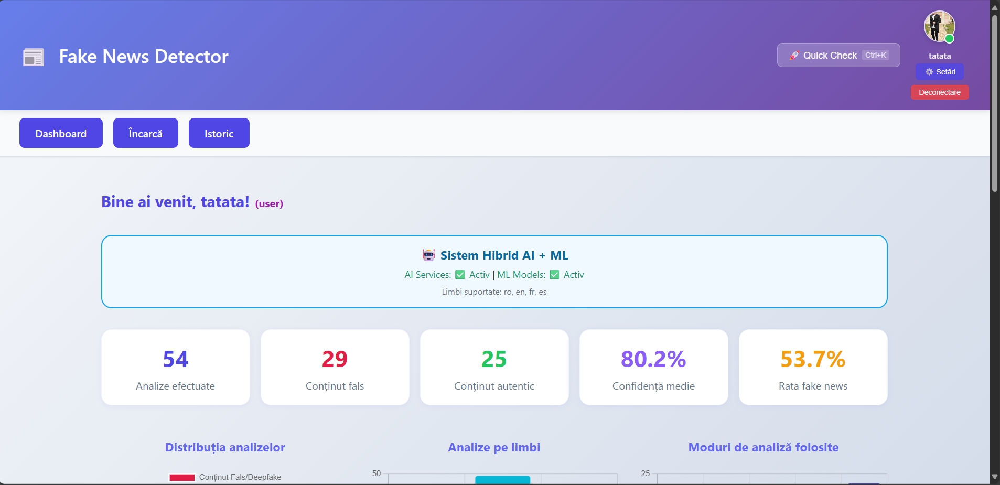
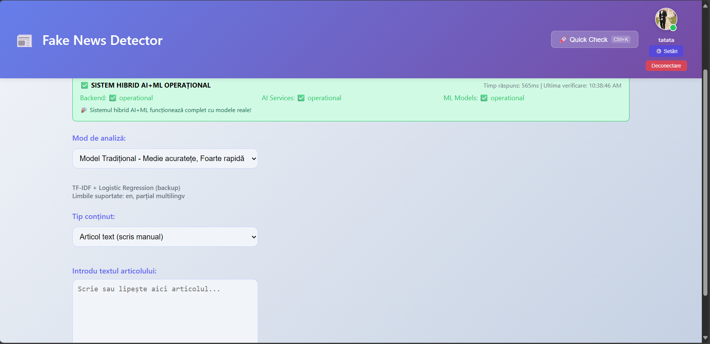
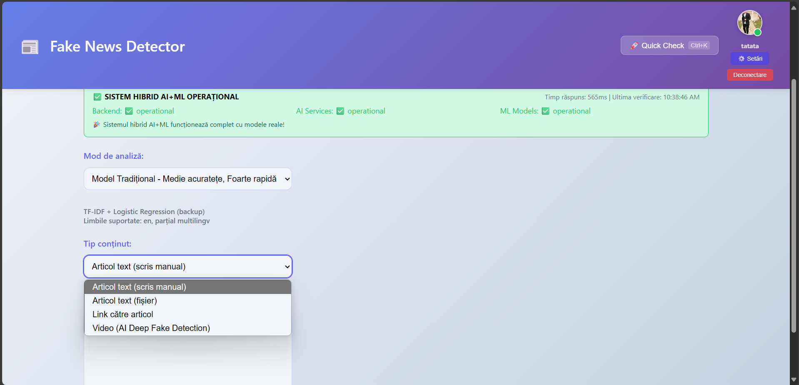
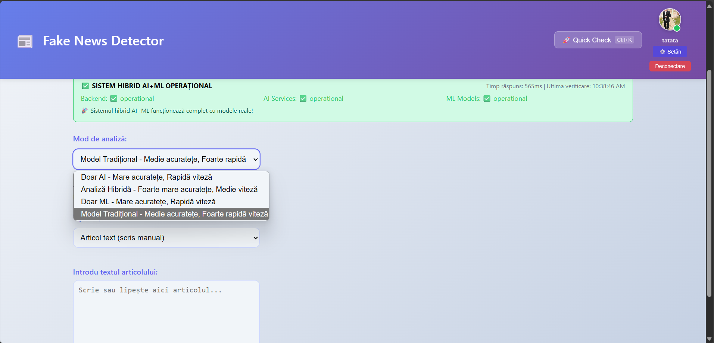
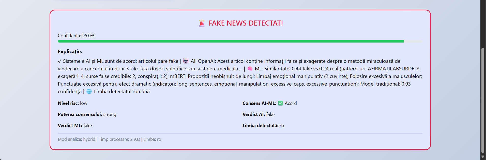
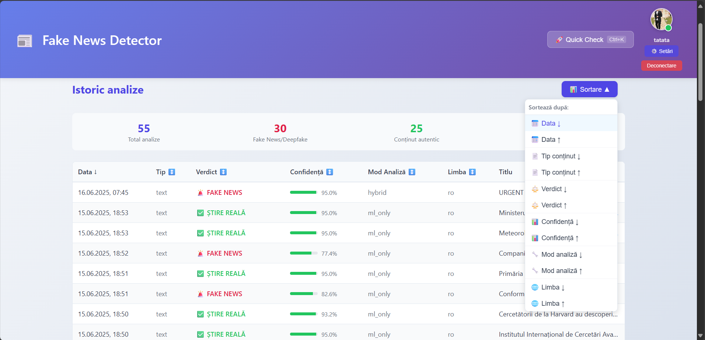
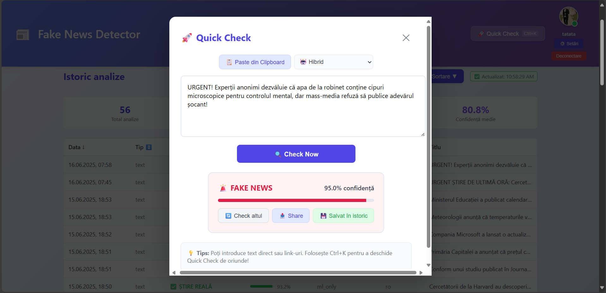
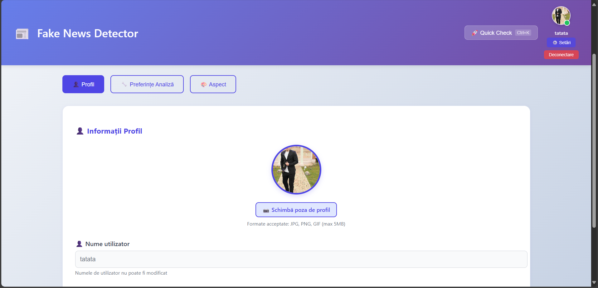
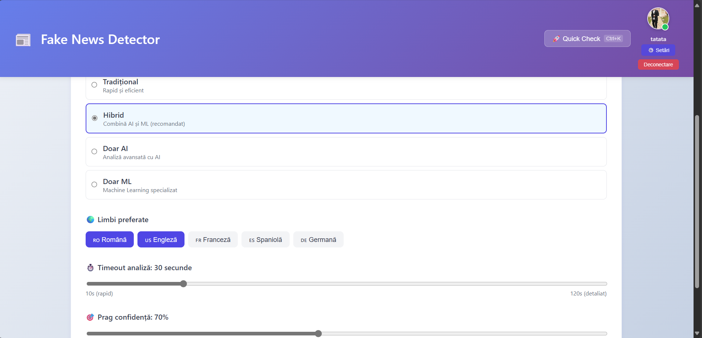
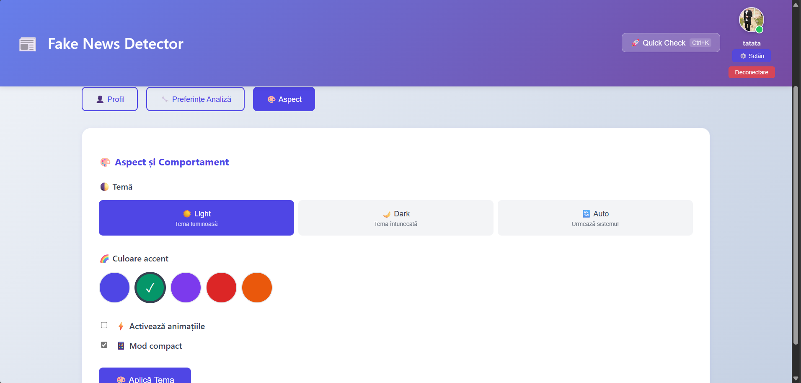

# Manual de Utilizare - Sistem de Detectare Fake News

## Introducere

Sistemul de detectare fake news oferă o interfață intuitivă pentru verificarea autenticității informațiilor. Aplicația combină inteligența artificială și machine learning pentru a oferi rezultate precise și de încredere.

---

## Primul Contact cu Aplicația

La prima accesare, utilizatorul este întâmpinat de o interfață de autentificare simplă. Procesul de înregistrare necesită doar un nume de utilizator și o parolă, fără informații personale sensibile. După introducerea datelor, contul devine activ imediat.

Sistemul implementează măsuri de securitate discrete: protecție împotriva atacurilor brute force și hash-uri sigure pentru parole. Sesiunile rămân active pentru a evita re-autentificarea frecventă.

---

## Dashboard-ul Principal

După autentificare, utilizatorul accesează dashboard-ul principal - centrul de comandă al aplicației.

Dashboard-ul afișează:
- **Statistici personale**: numărul total de analize, distribuția verdictelor
- **Analize recente**: ultimele verificări cu verdictele și confidence scores
- **Acțiuni rapide**: butoane pentru funcționalități principale

Zona superioară prezintă un mesaj de întâmpinare personalizat, iar elementele de navigație sunt organizate intuitiv cu iconuri sugestive.

---

## Analiza Conținutului

Sistemul suportă multiple modalități de introducere a datelor:

### Introducere Text Manual
Pentru verificarea rapidă a știrilor întâlnite online.

Utilizatorul poate copia textul suspect direct în câmpul dedicat și primi o analiză aproape instantanee. Interfața include spell-check automat și detecție automată a limbii.

### Upload Fișiere și URL-uri
Pentru documente mai complexe sau articole web.

Sistemul suportă:
- **Fișiere text**: .txt, .doc, .docx, .pdf (până la 1MB)
- **URL-uri**: extrage automat conținutul din pagini web
- **Video**: fișiere video până la 50MB sau URL-uri YouTube/Vimeo
- **Analiză batch**: procesare simultană a multiplelor surse

Sistemul implementează validări extensive pentru siguranță și oferă feedback real-time despre progresul upload-ului.

---

## Moduri de Analiză

Sistemul oferă patru moduri distincte de analiză:

### 1. Traditional Machine Learning
- **Acuratețe**: 75-85%
- **Timp**: <5 secunde
- **Utilizare**: Verificări rapide, articole standard

### 2. AI-Only
- **Acuratețe**: 80-90%
- **Timp**: 10-30 secunde
- **Utilizare**: Conținut complex, sarcasm, referințe culturale

### 3. ML-Only
- **Acuratețe**: 75-85%
- **Timp**: 1-2 secunde
- **Utilizare**: Research, transparență algoritmică

### 4. Hybrid Ensemble (Recomandat)
- **Acuratețe**: 85-95%
- **Timp**: 30-60 secunde
- **Utilizare**: Analiză comprehensivă, acuratețe maximă

Fiecare mod oferă configurații avansate pentru utilizatorii experți.

---

## Interpretarea Rezultatelor

Rezultatele sunt prezentate într-un format structurat și intuitiv.

### Elemente principale:
- **Verdict**: FAKE sau REAL cu justificare detaliată
- **Confidence Score**: 0-100% cu bară de progres colorată
- **Explicații detaliate**: breakdown pe componente
- **Metrici avansate**: credibilitate factuală, bias editorial, calitatea surselor

Score-urile sub 60% sunt marcate ca neconcludente pentru a preveni interpretările eronate.

---

## Managementul Istoric

Componenta de istoric oferă o perspectivă longitudinală asupra activității de fact-checking.

### Funcționalități:
- **Sortare multidimensională**: după dată, tip, confidence score, verdict
- **Filtrare avansată**: combinații de criterii pentru căutări complexe
- **Preview rapid**: informații condensate pentru fiecare analiză
- **View-uri personalizate**: salvarea combinațiilor frecvente de filtre

---

## Quick Check

Funcționalitatea Quick Check permite verificarea imediată a conținutului suspect.

### Caracteristici:
- **Activare rapidă**: Ctrl+K din orice pagină
- **Interfață modală**: overlay peste conținutul curent
- **Comenzi tastatură**: Alt+1 pentru Traditional, Alt+2 pentru AI, etc.
- **Istoric separat**: urmărirea verificărilor rapide

Rezultatele sunt prezentate în format condensat, cu opțiunea de expandare la analiză completă.

---

## Personalizarea Experienței

Secțiunea de setări oferă control granular asupra aplicației.

### Managementul Profilului

- **Imagine personalizată**: JPG, PNG, GIF (max 5MB)
- **Avatar automat**: generat din prima literă a username-ului
- **Username fix**: nu poate fi modificat după creare

### Preferințele de Analiză

- **Mod implicit**: Hibrid (recomandat)
- **Timeout analiză**: 10-120 secunde
- **Prag confidență**: 50-95%

### Personalizarea Aspectului

- **Teme**: Light, Dark, Auto
- **Culori accent**: albastru, verde, mov, roșu, portocaliu
- **Animații**: control pentru optimizarea performanței
- **Mod compact**: pentru ecrane mai mici

Setările se salvează în localStorage și se sincronizează între sesiuni.

---

## Concluzie

Acest manual oferă o ghidare completă pentru utilizarea sistemului de detectare fake news. Prin urmarea acestui ghid, utilizatorii vor putea:

- Naviga eficient în interfața aplicației
- Utiliza toate modalitățile de introducere a conținutului
- Alege strategia optimă de analiză
- Interpreta corect rezultatele
- Gestiona istoricul analizelor
- Personaliza experiența conform preferințelor

Sistemul continuă să evolueze cu noi funcționalități și îmbunătățiri. 
